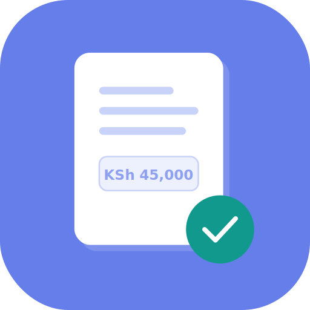

# Invoice Generator — Logo Assets

## Files

| File | Use |
|------|-----|
| `icon-512.svg` | Primary app icon (purple theme). Use for GitHub README, PWA manifest, social sharing. |
| `favicon.svg` | Browser tab icon. Simplified mark that holds at 16–32px. |
| `icon-theme-blue.svg` | Blue theme variant. |
| `icon-theme-teal.svg` | Teal theme variant. |

## Usage

### Favicon (add to `<head>` in index.html)
```html
<link rel="icon" type="image/svg+xml" href="favicon.svg">
```

### PWA manifest (manifest.json)
```json
{
  "name": "Invoice Generator",
  "short_name": "Invoicer",
  "icons": [
    { "src": "icon-512.svg", "sizes": "any", "type": "image/svg+xml" }
  ]
}
```

### GitHub README
```markdown

```

## Colors
- Primary: `#667eea` (purple, default theme)
- Accent: `#11998e` (teal — the checkmark badge)
- Document: `#ffffff`

## Converting to PNG
Use Inkscape, Figma, or any SVG tool to export at 16, 32, 180, 512px as needed.
